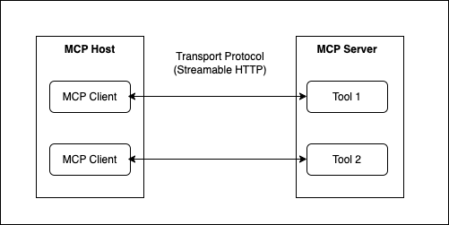

## Model Context Protocol ##

The [**Model Context Protocol (MCP)**](https://modelcontextprotocol.io/introduction)  is an open protocol standardizing how AI agents connect to external services, like databases, APIs, legacy systems, or third-party tools. Instead of building custom integrations for each service, MCP provides one standard interface for all external connections - somewhat like REST, but for AI agents.

The below diagram shows MCP Client and server connection mechanism using HTTP as transport protocol, another option is stdio which we are not showing in this workshop

Manual MCP implementation involves a lot of work: managing handshakes, connection state, message parsing, schema validation, etc. 

With Strands, on the other hand, it's really just a few lines of code as you can see in the notebooks we have provided for you to try it out.

The Strands SDK handles all the protocol complexity, letting you focus on agent functionality rather than integration details.

We will be creating a simple MCP server which provides a **credit_check tool**. It takes the customer id as input parameter and returns the credit score for the customer. The logic for credit scoring is to return the score for a known set of customer ids, however in real world scenario it could be collating all the required documents from the customer or from the customer profile already stored to maybe connecting to an external application to calculate the score.

We will use this MCP server later in the **Strands** lab where we integrate Strands tools and MCP tool. 

### Instructions to run the MCP server

Follow these steps to **run the MCP server** :
1. In JupyterLab, go to File -> New -> Terminal.
2. Within the terminal, type `cd ~/sample-building-agentic-ai-applications-on-aws/Mortgage_Assistant/3_mcp-server-client/strands_mcp`. This folder contains the MCP server code. 
3. Install the dependency using `pip install mcp strands-agents`
4. Start the server by typing in `python creditcheck_server_http.py`

The MCP server has now started. To understand the contents of the MCP server, open the creditcheck_server_http.py from '3_mcp-server-client/strands_mcp' folder in your JupyterLab environment.

### Instructions to test the MCP server

We will connect to the MCP server using our multi agent system in the strands and langgraph labs. However, to quick test the server, follow these steps

1. Open another terminal and type `cd ~/sample-building-agentic-ai-applications-on-aws/Mortgage_Assistant/3_mcp-server-client/strands_mcp`
2. Connect to the MCP server using the MCP client by typing this command `python strands_mcp_client.py`