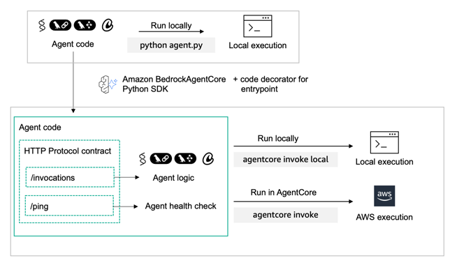

# Hosting Strands Multi-Agent System on AgentCore Runtime

## Overview

This tutorial demonstrates how to host Strands multi-agent systems on **Amazon Bedrock AgentCore Runtime** using the Amazon Bedrock AgentCore Python SDK. Learn to transform your multi-agent code into a standardized HTTP service that integrates seamlessly with Amazon Bedrock's infrastructure.

AgentCore Runtime is a **framework and model-agnostic** platform that can host agents built with any agentic framework (Strands Agents, LangGraph, CrewAI) and any LLM model (in Amazon Bedrock, OpenAI, etc.).

The Amazon Bedrock AgentCore Python SDK acts as a wrapper that:

- **Transforms** your agent code into AgentCore's standardized protocols
- **Handles** HTTP and MCP server infrastructure automatically
- **Lets you focus** on your agent's core functionality
- **Supports** two protocol types:
  - **HTTP Protocol**: Traditional request/response REST API endpoints
  - **MCP Protocol**: Model Context Protocol for tools and agent servers

### Service Architecture

When hosting agents, the SDK automatically:

- Hosts your agent on port `8080`
- Provides two key endpoints:
  - **`/invocations`**: Primary agent interaction (JSON input → JSON/SSE output)
  - **`/ping`**: Health check for monitoring

Once your agent is prepared for deployment on AgentCore Runtime, you can use the Amazon Bedrock AgentCore StarterKit to deploy it to deploy it to AgentCore Runtime.

With the Starter Kit you can configure your agent deployment, launch it to create an Amazon ECR repository with the Agent's configuration and the AgentCore Runtime endpoint and invoke the created endpoint for validation.

Once deployed, your AgentCore Runtime architecture in AWS looks as following:

In this tutorial you will learn:

* How to create a Strands multi-agent system with specialized agents
* How to deploy multi-agent systems to AgentCore Runtime
* How to integrate with remote MCP tools hosted on another AgentCore Runtime
* How to connect to Amazon Bedrock Knowledge Base for retrieval
* How to test your deployed multi-agent system

### Tutorial Details

| Information         | Details                                                   |
|:--------------------|:----------------------------------------------------------|
| Tutorial type       | Multi-Agent System Deployment                            |
| Agent type          | Multi-Agent with MCP Integration                          |
| Tutorial components | Hosting Strands Multi-Agent on AgentCore Runtime + MCP   |
| Tutorial vertical   | Mortgage/Financial Services                               |
| Example complexity  | Easy                                                      |
| Framework used      | Strands Agents                                            |
| SDK used            | Amazon BedrockAgentCore Python SDK, MCP, and Strands     |

### Tutorial Architecture
In this tutorial we will describe how to deploy a Strands multi-agent mortgage assistant system to AgentCore Runtime with MCP integration.

For demonstration purposes, we will create a comprehensive mortgage assistant with specialized agents for general mortgage questions, existing customer queries, and credit checks through remote MCP tools.

### Tutorial Key Features

* Multi-Agent System Architecture
* Remote MCP Tool Integration
* Knowledge Base Integration
* Authentication Between AgentCore Runtimes

## Key Benefits

- **Framework Agnostic**: Works with any Python-based agent framework
- **Model Flexible**: Support for LLMs in Amazon Bedrock, OpenAI, and other LLM providers
- **Production Ready**: Built-in health checks and monitoring
- **Easy Integration**: Minimal code changes required
- **Scalable**: Designed for enterprise workloads
- **MCP Integration**: Native support for Model Context Protocol servers

## Getting Started

This example includes:

- Step-by-step setup instructions
- Complete code samples
- Testing guidelines
- Best practices

## Next Steps

After completing the tutorial, you can:

- Extend these patterns to other frameworks and models
- Deploy to production environments
- Integrate with your existing applications
- Scale your agent infrastructure
