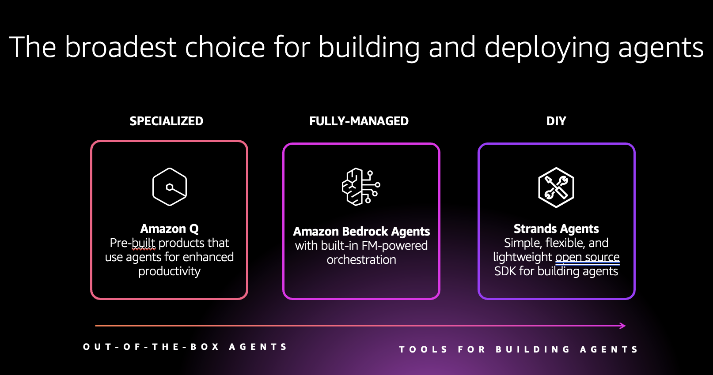
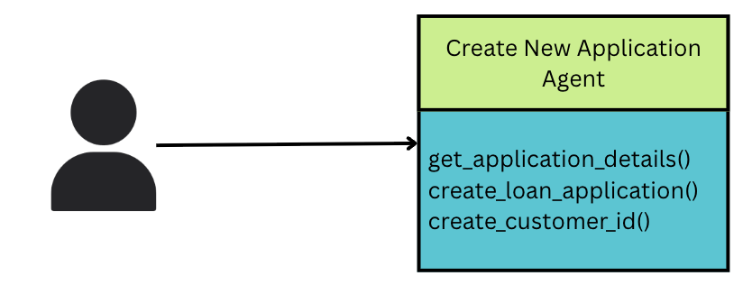
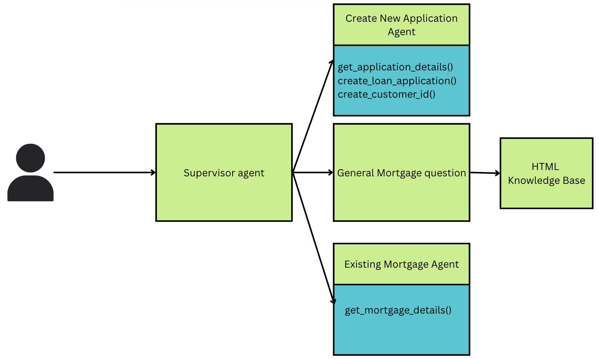
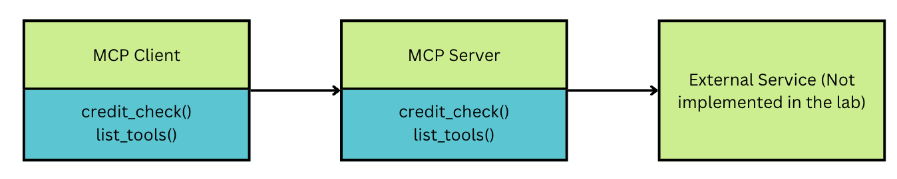

#### Agentic AI workshop

Welcome to the agentic AI workshop!.

If you are beginning your journey on Agentic AI or are looking to dive deep into cool new techniques such as multi agent collaboration or Model context Protocol, then you are in the right place.

This repository contains workshops that helps your learn how to build Agentic AI systems on AWS.

### Agentic AI in AWS
To build AI agents in AWS, you have three options as shown below.

Customers that want a fully managed way to build agents go the Bedrock agents route. For DIY, customers choose either Strands agents or open source framework like Langgraph. This workshop covers  Bedrock agents, Strands Agents and Langgraph

### Building AI Agents using Amazon Bedrock
The first lab walks the participants through the process of building a single AI agent using Amazon Bedrock agents. For the mortgage processing use case the single agent walks a cutomer through the process of a new mortgage application preapproval.

The second lab expands the single agent to a multi agent use case using Amazon Bedrock agents. We introduce two other agents for the mortgage processing use case - An agent to answer questions using a knowedge base and another agent to answer questions on an existing mortgage. A supervisor agent is used to route the request to an appropriate agent.

### Building an MCP server
The third lab explains how to build an MCP server. For the mortgage processing use case the MCP server will be used to perform a credit check for the customer. The MCP server built in this lab uses HTTP protocol and will be used in the next two labs.

### Building AI agents using Strands Agent
The fourth lab build a multi agent collaboration workflow using Strands Agent. It also includes the MCP server built above as part of its workflow. The Strands Agent is then deployed on AWS using AWS lambda.

### Building AI agents using LangGraph.
The fifth lab walks the participants through the process of building a multi agent collaboration workflow with MCP support using LangGraph.

This repository contains multiple labs based on the use case for a 'mortgage assistant'. In due course of time, more use cases will be added. To get started, click [here(!https://github.com/aws-samples/sample-building-agentic-ai-applications-on-aws/tree/main/Mortgage_Assistant)]